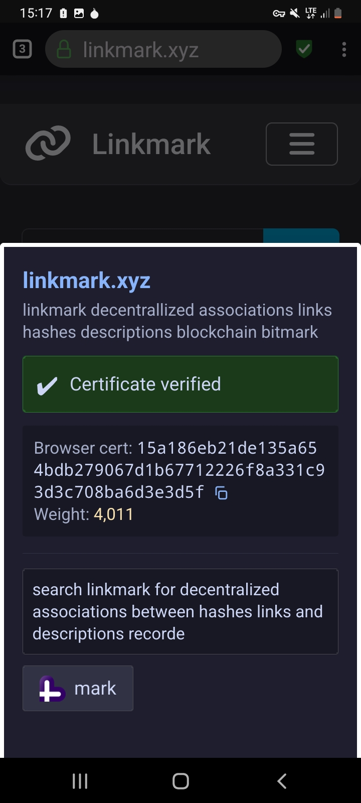
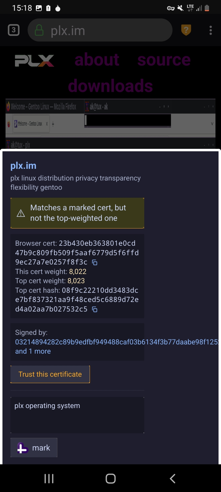
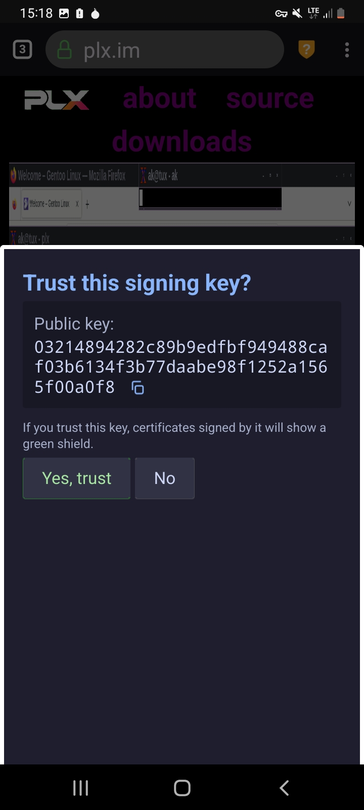
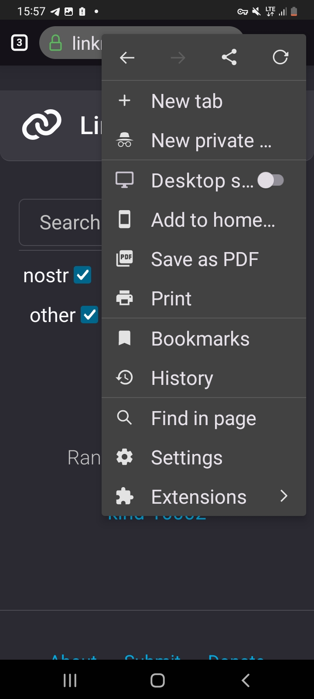
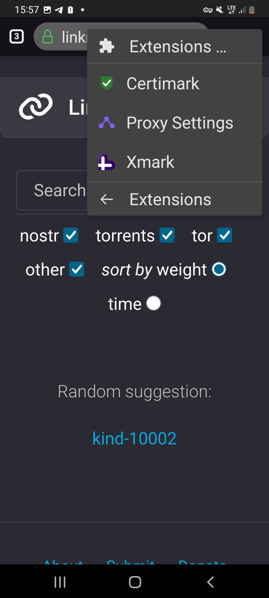

<h2 align="center"><b>Lux Browser</b></h2>

---

## Screenshots

<table>
 <tr>
 <td></td>
 <td></td>
 <td></td>
 <td></td>
 <td></td>
 </tr>
</table>

---

## Introduction

Lux is a fork of [SmartCookieWeb-Preview](https://github.com/cookiejarapps/smartcookieweb-preview) - an open-source project intended to provide freedom of web browser configuration on mobile. Lux adds powerful Bitmark-related features that allow you to interact with the blockchain to get more information about the web sites you visit, as well as mark the sites on the blockchain.

---

## Play Store

Coming soon.

---

## F-Droid

SCWP needs source code changes to be accepted on F-Droid which have not currently been made (building GeckoView and Android Components from source instead of fetching from Mozilla Maven, etc).

---

## Support

Need help? Open an issue here, or:

- Email us at `support@luxbrowser.com`

---

## Installation

- To get started with this project, import it into Android Studio or build from the command line with Gradle:
 
 `gradlew assembleDebug` or `./gradlew assembleDebug`

---

## Features

- Modern, clean UI
- Blocks ads and trackers
- Uses the Bitmark blockchain to provide certificate info and descriptions for the sites/pages you visit
- Allows you to mark links on the blockchain using the Linkmark protocol
- Your public X/Twitter posts are marked on the blockchain and nostr by default (Xmark)
- Proxy settings (for Tor/onion links, for example)

---

## Contributing

Contributions are greatly appreciated. Feel free to open an issue or pull request or help translate

## Donate

XMR: 84qp8nTgei5RrjFzXW3KP3MoFmvh8CcRUBzuGtLpRE2PNr7W3nR7KpU3vxBuRNjHhfcLe8FoXGPzDhyPQk6kHmbb6Fuu3KQ  
BTM: bE28ZG3FpoGnyxobDFiybjJsQHUb9mLygb  
BTC: bc1q0795vnddk099je8pp98uqckjlwzamm5t3hdfmz

---
